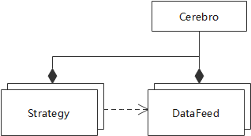

# 3 了解Bt的结构

本系列的第三部分，读完本章节可对BT主要类组件有个初步认识，然后通过一个最简单的双均线金叉死叉策略实例，演示各个组件模块起到的作用。

## BT主要类组件介绍

核心组件：

- Cerebro
- DataFeed
- Strategy
- Order / Trade

增强组件：

- Anaplyzer
- Observer
- Opimiter（优化器）
- 

## 双均线策略示例

代码：

代码说明：

## 扩展1：Cerebro.run() 执行多个策略，返回什么值？

## 扩展2：快速访问策略参数

self.p.short_window

## Backtrader的结构

让我们看一个最简单的Bt回测：最少需要三个对象就可以完成：

- 一个DataFeed
- 一个Strategy
- 一个Cerebro

### 1. DataFeed对象

为回测提供数据的对象，其是一组Line对象组合。

平台默认支持的DataFeed有：

- CSV格式文件

- Yahoo在线数据

- Pandas DataFrames格式数据

- 从其他渠道来的数据（通过配置实现）

如何获取DataFeed对象将在本系列第四部分详细说明。

### 2. Strategy对象

用户需要写一个backtrader.Strategy的子类以存放具体的交易逻辑。

Strategy有两个最重要的函数需override：

- \_\_init\_\_()
- next()

init是在回测前对个性化数据进行计算；

next中存放针对每个Bar的交易逻辑指令，在next()中对情况进行判断并作出买卖指定。

### 3. Cerebro对象

Cerebro（西班牙语意“大脑”）是回测的引擎，是组织各个部件的总程序。

Cerebro将各个组件组合在一起，启动回测，返回回测的结果，并提供可视化等功能。

Bt的结构是典型的按Bar逐期执行的回测框架。其中Bar是指一个业务周期，可能是日、15分钟或毫秒，每个Bar都有Open/Close/High/Low/Vol等价量要素数据。

逐期执行的概念，就是假设从有一个list存放从开始日到结束日的所有交易日期，由远到近排列。 BT会先读取T0日期数据，然后调用策略代码，然后再调用T1日期数据后再调策略代码，直到所有的日期都执行完毕。

在Bt中上述概念被成为“Line Iterators”，策略对象(Strategy)和指标对象(Indicators)都是line iterators。

根据我的理解，把BT的执行顺序绘制成下图：

上图中展示BT框架是如何调用我开发的策略代码的过程。

其中要说明的是如果有窗口数据要计算（比如移动平均），则执行不是从T0Bar开始，而是从TnBar开始，

## Line的概念

line iterators概念

策略对象(Strategy)和指标对象(Indicators)都是line iterators。

next()函数在每次迭代中调用。

## 数据的访问

## 

## 复权的概念

1. BT架构介绍
2. Line的概念
3. plot绘图
