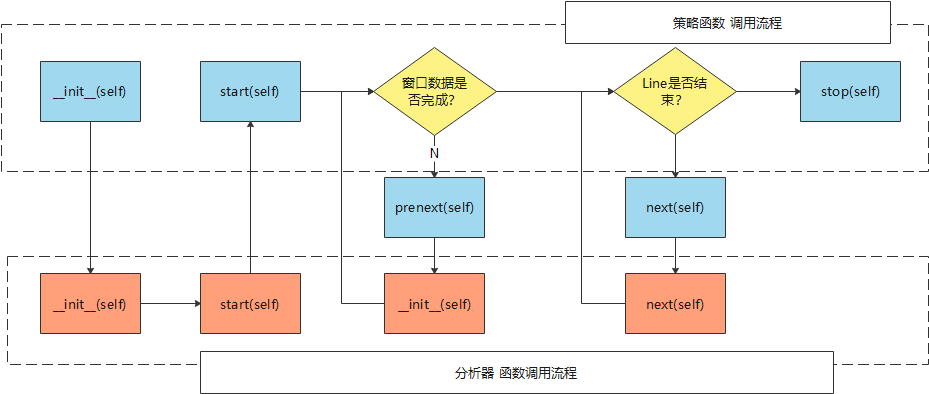

# 5 引擎和策略（Cerebro & Strategy）

## 策略

### 策略生命周期

### 下单

### 信息点

len(self)

### 策略参数

定义和访问

### 观察者模式

notify_order(order)
notify_trade(trade)
notify_cashvalue(cash, value)


## Broker

### 现金

### 滑点

### 手续费

### Position

### Trade


- Cerebro和相关组件关系
- Cerebro.run
- 策略类Strategy结构
- 策略的执行顺序
- data line的调用
- 策略Signals技术
- 数据的预加载
- Broker
  - 滑点
  - 佣金

## 策略的执行流程

策略执行的过程中，Strategy实现类的各函数相应被调用，其调用顺序如下图所示：


说明：

- 如在 __init__() 中计算了SMA等需要窗口时间的指标，如窗口期还未结束则调用prenext，结束了调用next。

## 策略+分析器的执行流程

当回测中既有策略（Strategy）也有分析器（Analyzer）的时候，各函数回测调用顺序如下图：




## 多个策略同时运行的情况

Cerebro有addstrategy函数，可支持多个策略同时运行。多策略如何运行，先抛结论，后面有实现代码：

- 一个Cerebro可以添加多个策略，run()后将返回多个结果的列表；
- 在每个运行周期中，多个策略依次执行；
- 由于Broker只有一个，多个策略共享一个资金池；
- 分析器将在每个策略运行都都运行一次，即一个分析器可处理跨策略的性能。

我们直接看代码效果：

```python
import backtrader as bt
import bc_study.tushare_csv_datafeed as ts_df
from backtrader import Analyzer

# 本案例中，将执行两个策略（策略A和策略B）、一个分析器

# 策略A，3日买，5日卖
class MyStrategy_A(bt.Strategy):

    def log(self, text, dt=None):
        ''' Logging function for this strategy'''
        dt = dt or self.datas[0].datetime.date(0)
        print('【策略A】%s, %s' % (dt.isoformat(), text))

    def __init__(self):
        self.log("__init__()")
        self.dataopen = self.datas[0].open

    def next(self):
        # 输出当日价格
        self.log('Open={0}, 昨Open={1}, 前Open={2}'.format(self.dataopen[0], self.dataopen[-1], self.dataopen[-2]))

        day = len(self)
        if day == 3:
            self.buy()
            self.log("A 买入")
        elif day == 5:
            self.close()
            self.log("A 平仓")


# 策略B，2日买，6日卖
class MyStrategy_B(bt.Strategy):

    def log(self, text, dt=None):
        ''' Logging function for this strategy'''
        dt = dt or self.datas[0].datetime.date(0)
        print('【策略B】%s, %s' % (dt.isoformat(), text))

    def __init__(self):
        self.log("__init__()")
        self.dataopen = self.datas[0].open

    def next(self):
        # 输出当日价格
        self.log('Open={0}, 昨Open={1}, 前Open={2}'.format(self.dataopen[0], self.dataopen[-1], self.dataopen[-2]))

        day = len(self)
        if day == 2:
            self.buy()
            self.log("B 买入")
        elif day == 6:
            self.close()
            self.log("B 平仓")


# Analyzer A
class MyAnalyzerA(Analyzer):

    def log(self, txt, dt=None):
        ''' Logging function for this strategy'''
        dt = dt or self.datas[0].datetime.date(0)
        print('【分析器A】%s, %s' % (dt.isoformat(), txt))

    def next(self):
        # 针对策略的调用
        # self.log("策略对象的引用: {0}".format(self.strategy))

        self.log("今日收盘价: {0}".format(self.datas[0].close[0]))

    def get_analysis(self):
        return "分析A结果"


# 启动回测
def engine_run():
    # 初始化引擎
    cerebro = bt.Cerebro()

    # 给Cebro引擎添加策略
    cerebro.addstrategy(MyStrategy_A)
    cerebro.addstrategy(MyStrategy_B)

    # Analyzer
    cerebro.addanalyzer(MyAnalyzerA, _name='analyzer_a')

    # 设置初始资金：
    cerebro.broker.setcash(10000.0)

    # 从csv文件加载数据
    data = ts_df.get_csv_daily_data(stock_id="600016.SH", start="20190101", end="20190115")
    cerebro.adddata(data)

    print('初始市值: %.2f' % cerebro.broker.getvalue())
    # 回测启动运行
    result = cerebro.run()
    print("回测运行返回值 = {0}".format(result))
    print("LEN(返回值) = {0}".format(len(result)))
    print('期末市值: %.2f' % cerebro.broker.getvalue())

    # 分析器结果
    print("分析器 A = {0}".format(result[0].analyzers.analyzer_a.get_analysis()))


if __name__ == '__main__':
    engine_run()
```
